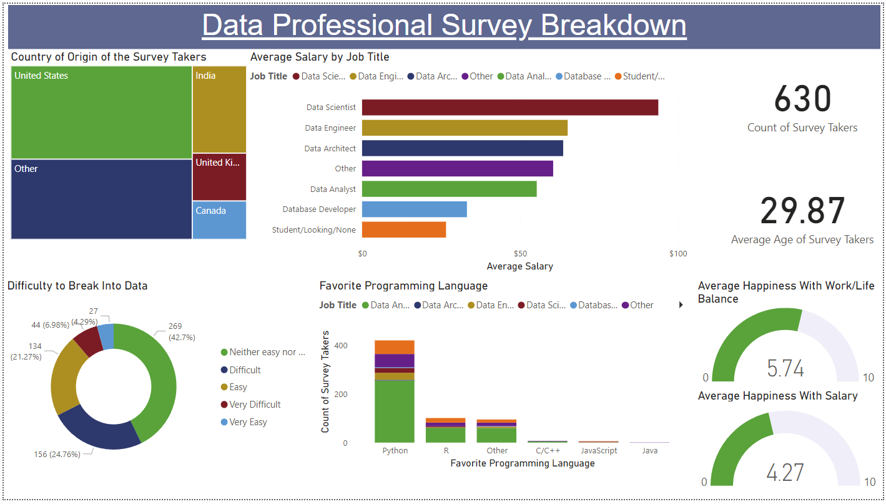

# Data Professional Survey Breakdown

The purpose of this project is to practice **Microsoft Power BI** and its set of tools, data manipulation, and dashboard creation. The dataset used in this project was taken from this repository [https://github.com/AlexTheAnalyst/Power-BI/blob/main/Power BI - Final Project.xlsx](https://github.com/AlexTheAnalyst/Power-BI/tree/main), which is a dataset created from a survey with professionals from different data fields for a YouTube channel focused on Data Analysis.

We initially examined the dataset using **Microsoft Excel** just to check the data, but we decided to perform as many steps as possible in **Microsoft Power BI**.

## Step by Step:

Here is the solution using **Microsoft Power BI**. After reviewing the columns and rows of the dataset with **Microsoft Excel**, we imported the spreadsheet and decided to transform the data using Power Query.

### 01. Data Cleaning with Power Query

1. We removed columns that were not relevant for analysis (Browser, OS, City, Country, Referrer).
2. Column Q1 was cleaned using Split Column and Left-Most Delimiter to focus the titles on general categories (including Other). The same procedure was applied to columns Q4, Q5, and Q11.
3. We decided to create a column with the average salaries of the professionals. To do this, we copied column Q3, split it again using Split Column, and delimited it with Digit to Non-Digit. We cleaned non-numeric values using the Replace Values function, added a new column, transformed the data type from Text to Whole Numbers, and wrote a DAX formula to calculate the average of these salaries.

### 02. Visualizations:

1. We created a Box Text to display the title "Data Professional Survey Breakdown."
2. 2 Cards: one displaying the Count of Survey Takers and another for the Average Age of Survey.
3. For a Stacked Bar Chart: we transformed the data type of Average Salary from Text to Decimal Number and created the chart for Average Salary by Job Title.
4. Stacked Column Chart: created by counting the Unique ID by Programming Language.
5. Treemap: we thought of an alternative that could reflect the reality of jobs and salaries, in addition to the languages used by data professionals worldwide. When selecting a country, the data in the dashboard adjusts accordingly.
6. 2 Gauges: the gauges were designed to understand the average satisfaction of professionals in terms of salary and work-life balance. The charts were created using the maximum and minimum values from their respective columns.
7. Donut chart: although not our preferred visualization, we assembled a Donut Chart that reflects the difficulty of obtaining the first job in the data field, with values represented by the count of the Unique ID.

  

